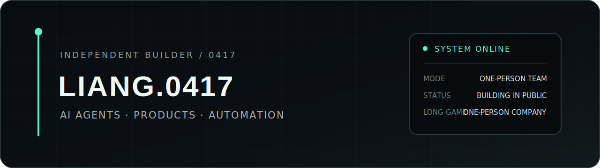

<p align="center">
  
</p>

### BUILD SMALL. THINK IN SYSTEMS. SHIP IN PUBLIC.

I build AI-native products and the systems that keep them useful after the demo.

把 AI 当作杠杆，把模糊的想法变成可以运行、验证和持续迭代的产品。正在探索：一个人借助 agents、automation 与 open source，究竟能走多远。

### CURRENT SIGNAL

- `OPEN SOURCE` [Personal AI Portfolio](https://github.com/liang0417/personal-ai-portfolio) — a React + Vite foundation for a personal site, writing and project showcase.
- `BUILDING` a public trail of experiments, decisions and reusable tools.
- `EXPLORING` agent workflows, product automation and the one-person company.

### BUILDER OS

```text
OBSERVE → PROTOTYPE → SYSTEMIZE → SHIP → ITERATE
```

Useful over impressive. Systems over one-off demos. Evidence over slogans.

---

<sub>`SYSTEM ONLINE · 2026`</sub>
